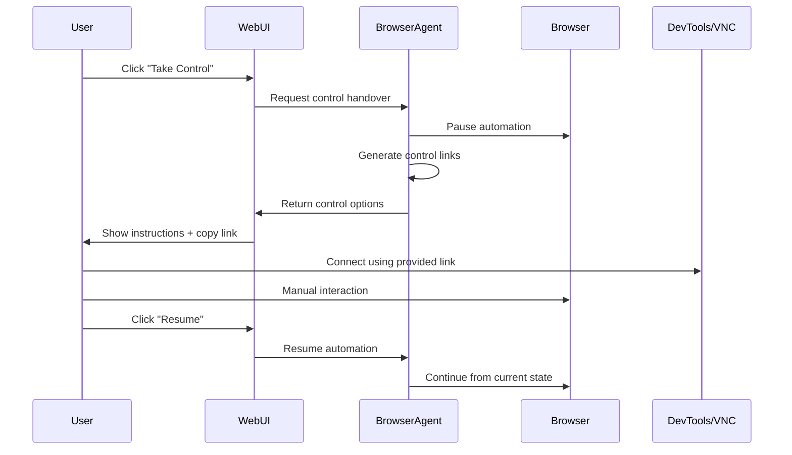

# Browser Control Handover Implementation

This document describes the browser control handover feature that allows users to take manual control of the browser during automated tasks.

## Overview

The browser control handover feature enables seamless transitions between automated and manual browser control in Agent Zero. It supports both local development environments (using Chrome DevTools Protocol) and Docker containers (using VNC).

## Features

### 1. **Dual Environment Support**
- **Local Development**: Uses Chrome DevTools Protocol (CDP) for direct browser inspection
- **Docker Containers**: Uses VNC with virtual display for headless environments

### 2. **Automatic Environment Detection**
- Detects Docker environment automatically using `/.dockerenv` and `/proc/1/cgroup`
- Configures appropriate browser settings and control methods

### 3. **Multiple Control Methods**
- **CDP Control**: DevTools integration for local development
- **VNC Control**: Virtual display with VNC server for Docker environments
- **Web VNC**: Optional noVNC for browser-based VNC access

## Implementation Details

### Core Components

#### 1. **BrowserAgent Tool** (`python/tools/browser_agent.py`)
- **State Class**: Enhanced with Docker detection and VNC setup
- **CDP Capture**: Extracts WebSocket endpoint for DevTools connection
- **VNC Setup**: Configures virtual display and VNC server in Docker
- **Hand-over Control**: Provides appropriate control options based on environment

#### 2. **API Endpoint** (`python/api/browser_control.py`)
- **`/browser_control`**: Returns current browser control status and available options
- **Multi-format Response**: Supports both CDP and VNC control information

#### 3. **Web UI Integration** (`webui/index.html`, `webui/index.js`)
- **Take Control Button**: Appears when browser agent is active
- **Smart Instructions**: Shows appropriate control method based on environment
- **Clipboard Integration**: Automatically copies control links

### Environment-Specific Behavior

#### Local Development
```python
# Browser configuration for local development
headless_mode = True
browser_args = ["--headless=new", "--remote-debugging-port=0"]

# Control method: Chrome DevTools Protocol
devtools_link = f"chrome-devtools://devtools/bundled/inspector.html?ws={ws_path}"
```

#### Docker Container
```python
# Browser configuration for Docker
headless_mode = self.display_port is None
browser_args = [
    "--remote-debugging-port=0",
    "--no-sandbox", 
    "--disable-dev-shm-usage",
    "--disable-gpu"
]

# Control method: VNC
vnc_url = f"vnc://localhost:{display_port}"
```

## Usage

### 1. **Basic Browser Control**
```javascript
// In chat: Use takeover parameter
!browser "Navigate to example.com" takeover=true
```

### 2. **Manual Control Activation**
1. Click "Take Control" button in web UI
2. Follow displayed instructions for your environment:
   - **Local**: Copy DevTools link to Chrome address bar
   - **Docker**: Connect VNC client to displayed port
3. Interact with browser manually
4. Click "Resume" to continue automation

### 3. **API Usage**
```bash
# Check browser control status
curl -X POST http://localhost:50101/browser_control \
  -H "Content-Type: application/json" \
  -d '{"context": "agent_context_id"}'
```

## Docker Setup

### Required Packages
```bash
# Added to docker/base/fs/ins/install_base_packages1.sh
apt-get install -y --no-install-recommends \
    xvfb x11vnc xterm net-tools
```

### Virtual Display Configuration
```bash
# Automatic setup in Docker containers
Xvfb :1 -screen 0 1920x1080x24 -ac +extension GLX
x11vnc -display :1 -rfbport 5901 -forever -shared -nopw
```

### noVNC Installation (Optional)
```bash
# Web-based VNC access
cd /opt
git clone https://github.com/novnc/noVNC.git
./utils/launch.sh --vnc localhost:5901 --listen 6080
```

## Browser Control Flow



## Configuration

### Environment Variables
```bash
# Auto-detected, but can be overridden
DISPLAY=:1              # For Docker virtual display
BROWSER_CONTROL_MODE=auto  # auto|cdp|vnc|disabled
```

### Browser Arguments
The implementation automatically adds appropriate Chrome arguments based on environment:

**Local Development:**
- `--headless=new`
- `--remote-debugging-port=0`

**Docker Container:**
- `--no-sandbox`
- `--disable-dev-shm-usage` 
- `--disable-gpu`
- `--remote-debugging-port=0`
- `--start-maximized` (if virtual display available)

## Security Considerations

1. **CDP Access**: Only exposed when explicitly requested
2. **VNC Security**: Uses localhost-only connections
3. **No Authentication**: VNC runs without password (suitable for development containers)
4. **Port Management**: Automatic port allocation to avoid conflicts

## Error Handling

The implementation gracefully degrades when control methods are unavailable:

```python
if not control_options:
    msg = "❌ Browser control not available - no CDP or VNC endpoints found"
    return {"error": msg}
```

Common scenarios:
- **CDP Unavailable**: Fallback to VNC in Docker
- **VNC Setup Failed**: Continue with headless automation
- **No Control Methods**: Display error message

## Testing

### Local Testing
1. Start Agent Zero: `python run_ui.py`
2. Run browser command with `takeover=true`
3. Verify DevTools link generation and clipboard copy
4. Test manual control and resume functionality

### Docker Testing
1. Build Docker image with VNC support
2. Run container with port forwarding: `-p 5901:5901 -p 6080:6080`
3. Test VNC client connection
4. Verify browser control handover in containerized environment

## Troubleshooting

### Common Issues

1. **"CDP WebSocket endpoint not available"**
   - Check browser arguments include `--remote-debugging-port=0`
   - Verify Playwright version compatibility

2. **"VNC setup failed"**
   - Ensure xvfb and x11vnc are installed
   - Check available ports with `netstat -ln`

3. **"Take Control button not visible"**
   - Verify browser agent is active
   - Check browser control API endpoint response

### Debug Commands
```bash
# Check virtual display
ps aux | grep Xvfb

# Check VNC server
ps aux | grep x11vnc

# Test VNC connection
vncviewer localhost:5901

# Check CDP endpoint
curl localhost:9222/json
```

## Future Enhancements

1. **Web VNC Integration**: Embed noVNC directly in Agent Zero UI
2. **Recording**: Capture manual interactions for replay
3. **Collaborative Control**: Multiple users controlling same browser
4. **Mobile Support**: Control mobile browser instances
5. **Authentication**: Secure VNC connections with passwords

## Conclusion

The browser control handover feature provides a seamless way to transition between automated and manual browser control, supporting both local development and Docker deployment scenarios. It maintains browser state continuity and offers multiple control methods based on the environment.